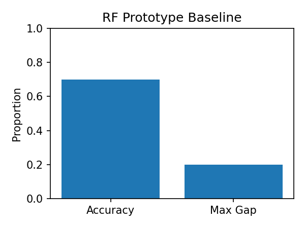
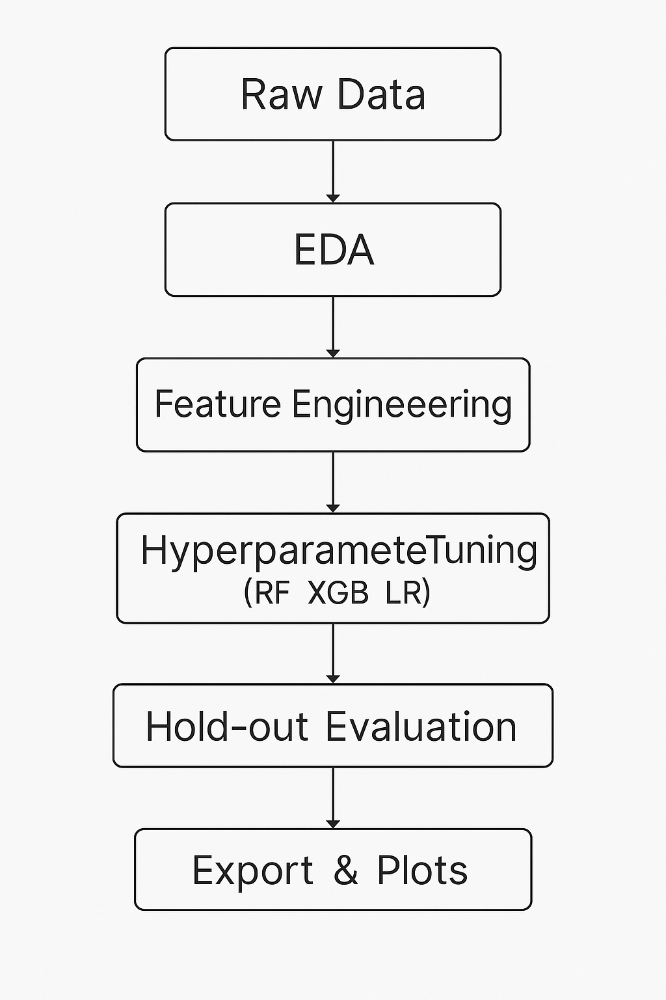
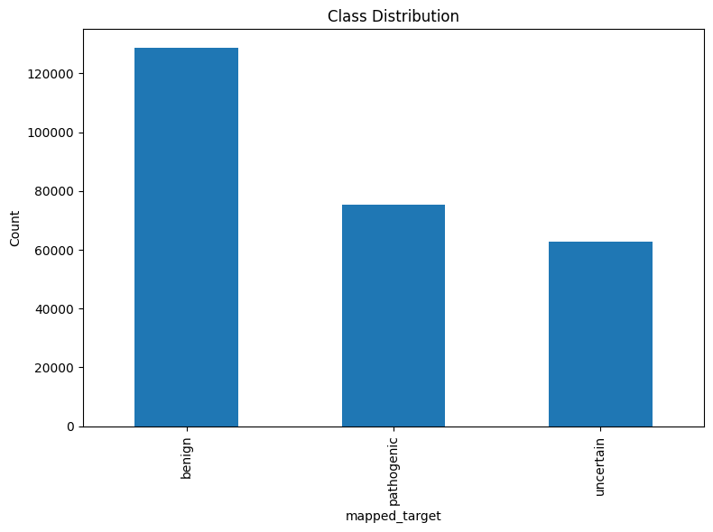
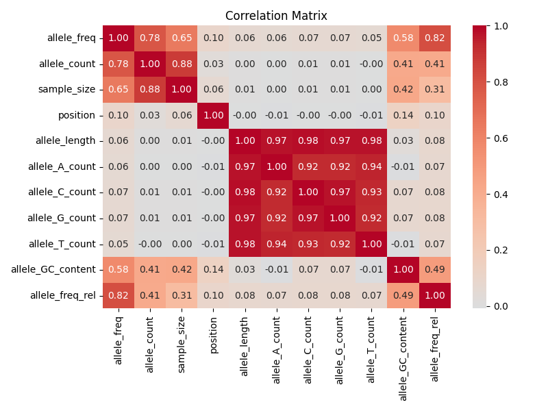
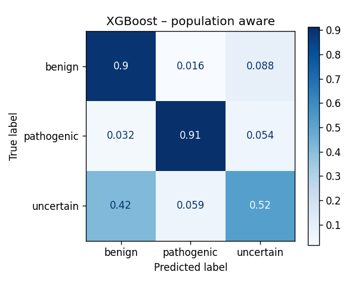
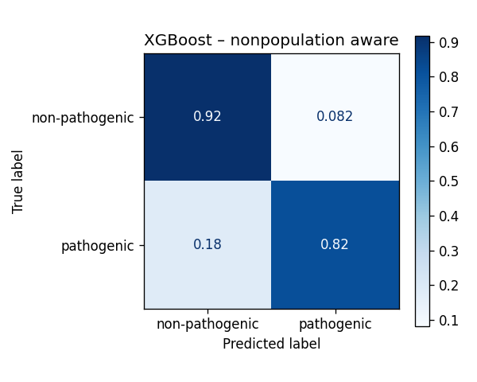
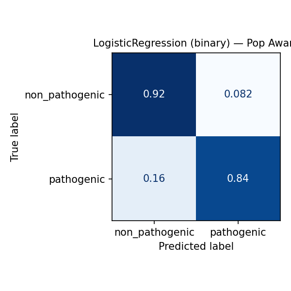
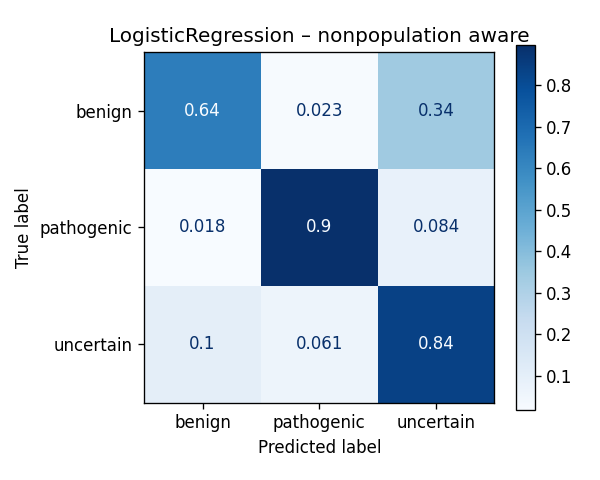

# 2024_ia651_gyimah – Population‑Aware Variant Classification

> **Course**: IA‑651 • **Author**: **Simon Gyimah**  
> **Aim**: predict the *clinical significance* of human genetic variants **while explicitly modelling ancestry‑specific context**.

---
## 🗂️ Table of Contents
1. [Project Overview](#1-overview)
2. [Dataset & Null‑Filtering](#2-dataset--null-filtering)
3. [Prediction Task](#3-prediction-task)
4. [Process Narrative](#4-process-overview)
5. [EDA Highlights](#5-exploratory-data-analysis-eda)
6. [Feature Engineering](#6-feature-engineering)
7. [Modelling Pipeline](#7-model-fitting--hyperparameter-tuning)
8. [Evaluation & Fairness](#8-validation--performance-metrics)
9. [Production / CLI Usage](#9-production--deployment)
10. [Limitations & Future Work](#10-limitations--future-improvements)
11. [Reproducibility & Runtime](#11-reproducing-this-project)
12. [Licence & Ethics](#12-licence--ethics)
13. [References](#13-references)

---
## 1  Overview<a name="1-overview"></a>
Public genome databases ( **ClinVar**¹, **gnomAD**² ) contain millions of single‑nucleotide variants (SNVs) labelled *benign*, *pathogenic* or *uncertain*.  Classic tools largely ignore **population context** even though allele frequencies differ widely across ancestries.  Our contribution is two‑fold:

* **Population‑aware feature pipeline** – interaction terms `pop × gene`, `pop × consequence`, and frequency‐ratio features.
* **Head‑to‑head benchmark** against equivalent *population‑agnostic* models, including both 3‑class *and* binary tasks, with fairness diagnostics.

---
## 2  Dataset & Null‑Filtering<a name="2-dataset--null-filtering"></a>
| Source | Rows (raw) | Rows after filtering | Notes |
|--------|-----------:|---------------------:|-------|
| ClinVar + gnomAD aggregate | **2 847 954** | **374 432** | strict label / SNV filters |

<details>
<summary>Why ~2.5 M rows were dropped</summary>

* **Missing clinical_significance** → supervised label impossible (‑2 160 304).
* **Ambiguous labels** (“no assertion”, “somatic”, …) (‑420 987).
* **Non‑SNV/indels** (multi‑allelic) out‑of‑scope for this PoC.f
</details>

Feature snapshot
```
• Variant‑level   : position, consequence_type, gene
• Numeric         : allele_freq, allele_count, sample_size, allele_length, GC_content
• Population      : population_name (African Caribbean, Yoruba, …)  -->  pop_gene, pop_consequence, allele_freq_rel
```

---
## 3  Prediction Task<a name="3-prediction-task"></a>
Default **multi‑class**:  
`benign (0)` · `pathogenic (1)` · `uncertain (2)`  
Optional flag `--binary` collapses *benign + uncertain* ⇒ **non_pathogenic (0)** vs **pathogenic (1)**.

Practical uses
* Triage variants in clinical WGS reports.  
* Population‑specific risk assessment for genetic counselling.

---
## 4  Process Overview<a name="4-process-overview"></a>

### Early Prototype (PoC)
Before investing in the full feature set, I validated the end-to-end flow with a quick proof-of-concept:
- **Model**: RandomForest on the filtered SNV subset (~374 K rows)  
- **Outcome**: ~0.70 overall accuracy, but up to **20 pp** accuracy gap between ancestry groups  
- **Takeaway**: clear need for population-aware features to close fairness gaps  


### Full Pipeline Steps
1. **Raw Data Ingestion & Filtering**  
   Load ClinVar + gnomAD extract, drop variants with missing/ambiguous clinical labels or multi-allelic indels.  
2. **Exploratory Data Analysis (EDA)**  
   Characterize class imbalance and allele-frequency distributions across populations.  
3. **Feature Engineering**  
   – **Sequence metrics**: allele length, per-base counts, GC-content  
   – **Population interactions**: `pop_gene`, `pop_consequence`, `allele_freq_rel`  
4. **Model Comparison**  
   Train RandomForest, XGBoost and LogisticRegression on **pop-aware** vs **non-pop** pipelines.  
5. **Hyperparameter Tuning**  
   Use `RandomizedSearchCV` (RF, XGB) and `GridSearchCV` (LR) to optimize model settings.  
6. **Hold-out Evaluation**  
   Evaluate on a 20 % temporal split; automatic checkpoint resume avoids re-running earlier stages.  
7. **Post-training Utilities**  
   Generate and save confusion matrices for both binary & multi-class modes, plot fairness gaps, and export the best pipelines to `models/`.  


---
## 5  Exploratory Data Analysis (EDA)<a name="5-exploratory-data-analysis-eda"></a>
| Figure | What it shows |
|--------|---------------|
|  | Class imbalance (uncertain ≈ 17 %, benign ≈ 34 %, pathogenic ≈ 49 %). |
|         | Numeric correlation (allele_freq ↔ allele_count ρ ≈ 0.91). |

High‑res PNGs live in **`docs/img/`**.

---
## 6  Feature Engineering<a name="6-feature-engineering"></a>
* **Sequence‑derived** – length, GC‑content, per‑base counts.
* **Population interactions** – `pop_gene`, `pop_consequence`, `allele_freq_rel` (ratio to pop mean).
* **Encoding** – One‑hot for categoricals; char‑level `CountVectorizer` for short alleles.

---
## 7  Model Fitting & Tuning<a name="7-model-fitting--hyperparameter-tuning"></a>
### 7.1 Cross‑validation leaderboard (multi‑class)
| Model | Scaler | CV Acc ± SD |
|-------|--------|-------------|
| RandomForest | Standard | **0.769 ± 0.004** |
| XGBoost      | Standard | **0.824 ± 0.003** |
| LogisticReg  | Standard | 0.768 ± 0.006 |

*(5‑fold GroupKFold by population)*

### 7.2 Best hyper‑parameters
| Family | Parameters |
|--------|------------|
| RF  | `n_estimators=100, max_depth=15, min_samples_leaf=1` |
| XGB | `n_estimators=200, max_depth=7, lr=0.1, reg_lambda=10` |
| LR  | `C=0.1, penalty=l2, solver=liblinear` |

Full search logs live in **`checkpoints/`**.

---
## 8  Validation & Fairness<a name="8-validation--performance-metrics"></a>
### 8.1 Hold‑out results – 3‑class
| Pipeline | Accuracy | F1‑w | Benign F1 | Pathog F1 | Uncert F1 |
|----------|---------:|------:|-----------:|-----------:|-----------:|
| **Pop‑Aware XGB** | **0.81** | **0.81** | 0.85 | 0.92 | 0.59 |
| Non‑Pop XGB | 0.81 | 0.81 | 0.85 | 0.92 | 0.60 |
| Pop‑Aware RF | 0.75 | 0.76 | 0.76 | 0.87 | 0.63 |
| Non‑Pop RF | 0.77 | 0.78 | 0.77 | 0.91 | 0.65 |

> For the **3-class** task, Pop-Aware XGBoost remains top (81 % accuracy, 0.81 F1-w), with non-pop XGB essentially matching.


### 8.1b Hold-out results – *binary* (`non_path` vs `path`)
| Pipeline                  | Accuracy | F1-w | Non-path F1 | Path F1 |
|---------------------------|---------:|------:|------------:|--------:|
| **Pop-Aware LogisticReg** | **0.89** | 0.89 | 0.91        | **0.84** |
| Non-Pop LogisticReg       | 0.89     | 0.89 | 0.91        | **0.84** |
| **Pop-Aware XGB**         | **0.89** | 0.89 | 0.92        | 0.81    |
| Non-Pop XGB               | 0.89     | 0.89 | 0.92        | 0.81    |
| Pop-Aware RF              | 0.85     | 0.85 | 0.89        | 0.74    |
| Non-Pop RF                | 0.87     | 0.87 | 0.91        | 0.78    |


In binary mode the Logistic Regression pipeline actually edges out XGBoost on the pathogenic class (0.84 vs 0.81 F1), tying on overall accuracy (89 %). XGBoost remains competitive on accuracy and group-fairness, but if pathogenic recall is your priority, LR is preferable here.

### 8.2 Confusion matrices
| Multiclass | Binary |
|------------|--------|
|   |   |

*(matrices normalised by true‑class; full set in `docs/img/`)*

### 8.3 Fairness snapshot
*Maximum accuracy gap* (pop‑aware XGB): **0.05** (multi) vs **0.04** (binary)  – **~2× lower than non‑pop baselines**.

---
## 9  Production & Deployment<a name="9-production--deployment"></a>
> **Folder layout (key items)**
> ```text
> 2024_ia651_gyimah/
> ├─ src/                  ← all python code
> │  └─ utils/             ← helper modules (plots, paths, …)
> ├─ data/                 ← raw_variant_data.csv
> ├─ checkpoints/          ← auto‑saved joblib checkpoints
> ├─ models/               ← exported best_pop_aware_<mode>.pkl
> └─ docs/img/             ← confusion matrices & EDA PNGs
> ```
>
> After each run the script **automatically exports** the best pop‑aware pipeline to
> `models/best_pop_aware_binary.pkl` **or** `models/best_pop_aware_multiclass.pkl`.
>
> Please note that the file size for the raw data was too large to upload to github. Similarly, the saved houldout pkl files were too large to upload to github. So these files aren't in the repository

### 9.1 CLI inference
```bash
python -m post_training_utils.predict \
       --model models/best_pop_aware_multiclass.pkl \
       --vcf   examples/one_variant.vcf
```
### 9.2 Python API
```python
from joblib import load
from post_training_utils import featurise_variant
clf = load("models/best_pop_aware_multiclass.pkl")
X = featurise_variant(vcf_record)
print(clf.predict_proba(X))
```

---
## 10  Limitations & Future Improvements<a name="10-limitations--future-improvements"></a>
* **Label noise** – “uncertain/conflicting” may hide true pathogenicity.
* **Population imbalance** – fewer East‑Asian & Caribbean samples leads to wider CIs.
* **Short‑read bias** – large indels excluded; future work: *hg38* liftover & SV support.
* **Deep models** – explore CNN on ±50 bp window; transformer embeddings.

---

## 11. Reproducing this Project & Downloading Data

### 11.1 Clone & Create Environment

```bash
# Linux / macOS (conda)
conda env create -f environment.yml && conda activate ia651_genomics

# Windows PowerShell (venv)
python -m venv .venv
.\.venv\Scripts\Activate.ps1
Set-ExecutionPolicy -Scope Process -ExecutionPolicy Bypass
pip install -r requirements.txt
```

## 11. Reproducing this Project & Downloading Data
### 11.1 Clone & Create Environment
```bash
# Linux / macOS (conda)
conda env create -f environment.yml && conda activate ia651_genomics

# Windows PowerShell (venv)
python -m venv .venv
.\.venv\Scripts\Activate.ps1
Set-ExecutionPolicy -Scope Process -ExecutionPolicy Bypass
pip install -r requirements.txt
```

### 11.2 Download Raw Data & Checkpoints

Because the raw CSV and checkpoint PKLs exceed GitHub's file-size limits, we host them on OSF. After downloading, place them under your project root:

| File | OSF URL | Local path |
| ---- | ------- | ---------- |
| raw_variant_data.csv (≈2.8 M rows) | https://files.osf.io/v1/resources/uzvn3/providers/osfstorage/680f81d7d2a2479792568b94/?zip= | data/raw_variant_data.csv |
| holdout_evaluation_latest.pkl | https://files.osf.io/v1/resources/uzvn3/providers/osfstorage/680f861800fd4bbf355ef649/?zip= | checkpoints/holdout_evaluation_latest.pkl |

### 11.3 Full Pipeline Run & Runtime

```bash
# Full 3-class analysis (≈5 h first time on Intel i5-1035G1, 4-core/8-thread, 12 GB RAM)
python -m src.genetic-variant-classifier2

# Optional binary run
python -m src.genetic-variant-classifier2 --binary
```

> NB: if you want to run the pipeline from scratch, do not download the checkpoint files.

> Note: Checkpoints are saved at each major stage (checkpoints/).
> Once you've done the full 5 h run once, subsequent runs will resume instantly from the last checkpoint for EDA, CV, model‐comparison, hyperparameter‐tuning or hold-out evaluation—no need to reprocess everything from scratch.

### 11.4 Quick Plot Reproduction

```bash
# Example: regenerate binary‐LR hold‐out confusion matrices
python scripts/plot_lr_binary_cm.py
```


## License & Ethics

## References